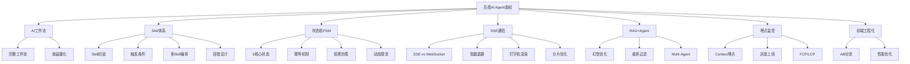

## 📋 目录

1. [AI辅助开发与工作流](#1-AI辅助开发与工作流)
2. [Skill封装与编排](#2-Skill封装与编排)
3. [有限状态机与任务调度](#3-有限状态机与任务调度)
4. [SSE通信与性能优化](#4-SSE通信与性能优化)
5. [RAG+Agent与Multi-Agent](#5-RAGAgent与Multi-Agent)
6. [埋点与监控](#6-埋点与监控)
7. [反问环节亮点](#7-反问环节亮点)
8. [知识点图谱](#8-知识点图谱)

---

## 1️⃣ AI辅助开发与工作流

**Q1：AI辅助开发的完整工作流，真实使用场景？**
- 🔑 **考察点**：AI Coding在实际研发中的融入方式
- 💡 **思路**：从需求分析→代码生成→Code Review→测试生成→文档生成全链路覆盖
- 📎 **场景举例**：PR描述自动生成、代码解释、单元测试生成、重构建议

**Q2：固化AI工作流的case、方案、收益？**
- 🔑 **考察点**：将AI能力产品化、标准化的能力
- 💡 **思路**：选取高频场景→沉淀最佳实践→形成标准化工作流→量化提效指标（如开发效率提升X%）

**Q3：能力如何封装为Skill？触发条件？意图识别是否人工干预？**
- 🔑 **考察点**：Agent Skill的设计哲学
- 💡 **思路**：
  - Skill封装：输入Schema + 执行逻辑 + 输出Schema
  - 触发条件：关键词匹配 / 意图分类 / 显式调用
  - 人工干预：兜底策略，阈值低时转人工

## 2️⃣ Skill封装与编排

**Q4：多Skill串行/嵌套，依赖冲突、参数不兼容的容错设计？有无编排优先级调度？**
- 🔑 **考察点**：复杂Agent任务编排的工程落地
- 💡 **思路**：
  - 依赖冲突：DAG拓扑排序检测环，依赖注入解耦
  - 参数不兼容：Schema校验 + 类型适配器 + 默认值兜底
  - 优先级调度：基于权重的优先级队列，高优Skill抢占执行

**Q6：Agent为什么选LangChain，不直接调OpenAI接口？**
- 🔑 **考察点**：框架选型与技术判断力
- 💡 **思路**：
  - LangChain优势：Chain抽象、Memory管理、Tool集成、回调机制
  - 劣势：黑盒过多、版本迭代快、调试困难
  - 选型权衡：快速原型用LangChain，生产级可考虑自研轻量引擎

**Q7：文案解析到自动剪辑全流程是否独立开发？优化点？Skill定义与步骤划分？**
- 🔑 **考察点**：复杂AI流程的拆解能力
- 💡 **思路**：
  - 拆解步骤：文案解析→关键帧提取→剪辑参数生成→FFmpeg执行→成片校验
  - 每个步骤封装独立Skill，通过Pipeline串联
  - 优化点：缓存中间结果、并行执行独立步骤

## 3️⃣ 有限状态机与任务调度

**Q8：为什么引入有限状态机？6个核心状态、流转规则、transitions实现？**
- 🔑 **考察点**：FSM在Agent任务管理中的应用
- 💡 **思路**：
  - 状态：PENDING → RUNNING → SUCCESS/FAILED/RETRY → TIMEOUT
  - transitions：事件驱动 + Guard条件判断
  - 实现：XState / 自研轻量状态机

**Q9：状态幂等、防止任务重复执行的机制？**
- 🔑 **考察点**：分布式系统的幂等设计
- 💡 **思路**：
  - 幂等：每个任务生成唯一ID + 状态去重
  - 重复执行：分布式锁（Redis Redlock）+ 状态机前置检查

**Q10：任务成功率99.5%的统计方式？每条任务是否标记状态？**
- 🔑 **考察点**：量化指标与可观测性
- 💡 **思路**：每条任务记录状态戳 → 聚合计算成功率 → 细化到每个Skill维度的成功率

**Q13：状态机卡死悬停、死循环的排查与熔断机制？**
- 🔑 **考察点**：Agent稳定性保障
- 💡 **思路**：
  - 检测：超时阈值(如30s无状态变更) + 心跳检测
  - 熔断：状态转换计数限制 + 强制超时重置
  - 排查：状态变更日志 + 事件溯源

**Q14：FFmpeg剪辑CPU/内存突增，Agent动态限流、任务分片降级方案？**
- 🔑 **考察点**：资源管理与自适应限流
- 💡 **思路**：
  - 资源监控：实时CPU/内存/IO指标采集
  - 动态限流：令牌桶 + 资源水位反馈调节
  - 分片降级：长视频分段处理→降低分辨率→降级为关键帧拼接

## 4️⃣ SSE通信与性能优化

**Q23：AI对话为什么优先SSE而非轮询？**
- 🔑 **考察点**：实时通信方案选型
- 💡 **思路**：
  - SSE优势：单向通道更轻量、浏览器原生支持、自动重连
  - 轮询缺点：频繁请求浪费资源、延迟高

**Q24：SSE与WebSocket区别？能否独立实现聊天通信整套逻辑？**
- 🔑 **考察点**：通信协议深入理解
- 💡 **思路**：
  - SSE：单向（服务端推送）、基于HTTP、轻量
  - WebSocket：双向全双工、需握手升级、适合实时互动
  - 聊天场景：SSE可做流式输出，但用户输入仍需HTTP请求

**Q25：SSE返回的数据结构？**
```json
data: {"type": "token", "content": "你好", "index": 0}
data: {"type": "done", "reason": "stop"}
```

**Q26：断连自动重连策略，指数退避算法落地，断点续传如何补丢失文本？**
- 🔑 **考察点**：网络容错与可靠性设计
- 💡 **思路**：
  - 指数退避：间隔 = base × 2^n + random_jitter，最大阈值30s
  - 断点续传：客户端缓存已接收的token序列号，重连时带上lastIndex

**Q27：打字机逐字输出实现？渲染间隔设多少？**
- 🔑 **考察点**：流式渲染体验优化
- 💡 **思路**：
  - 实现：SSE接收token → 缓冲队列 → requestAnimationFrame批量渲染
  - 间隔：50-100ms，保证流畅感且不过度频繁

**Q28：超长文本打字机卡顿，分片+异步队列优化方案？**
- 🔑 **考察点**：大文本渲染优化
- 💡 **思路**：
  - 虚拟列表 + 分片渲染
  - 异步队列：Web Worker处理文本，主线程只负责渲染

## 5️⃣ RAG+Agent与Multi-Agent

**Q37：Agent和普通Chatbot的区别？**
- 🔑 **考察点**：Agent本质理解
- 💡 **思路**：
  - Chatbot：被动回答，单轮/多轮对话
  - Agent：主动规划 + 工具调用 + 记忆管理 + 任务拆解执行

**Q38：Agent核心组成模块？**
- 🔑 **考察点**：Agent架构
- 💡 **思路**：LLM(推理引擎) + Memory(记忆) + Tools(工具) + Planning(规划) + Execution(执行)

**Q39：RAG+Agent场景，检索幻觉、无关文档召回的重排与过滤优化？**
- 🔑 **考察点**：RAG质量保障
- 💡 **思路**：
  - 重排：Cohere rerank / Cross-encoder二次排序
  - 过滤：相关性阈值 + 互信息过滤 + 事实一致性校验(LLM自评)

**Q40：Multi-Agent架构设计，分工策略、冲突协商机制如何落地？**
- 🔑 **考察点**：多Agent系统设计
- 💡 **思路**：
  - 分工：按领域/能力/数据权限划分
  - 协商：共享黑板模式 + 投票机制 + 仲裁Agent
  - 冲突：资源锁 + 优先级裁决 + 人工介入兜底

## 6️⃣ 埋点与监控

**Q17-22：埋点相关**（Context优化、旧埋点兼容、灰度上线、AB分流）
- 🔑 **考察点**：前端工程化与数据采集
- 💡 **思路**：
  - Context优化：减少Props逐层传递，但注意重渲染（useMemo/useCallback）
  - 灰度上线：按用户/地域/比例分批 + 新旧数据对比校验
  - AB分流：均匀哈希 + 稳定分流

**Q33-34：性能埋点（FCP/LCP采集）**
- 🔑 **考察点**：Web Vitals实战
- 💡 **思路**：
  - PerformanceObserver API采集
  - LCP阻塞：预加载关键资源、分片加载、懒加载非关键内容

## 7️⃣ 反问环节亮点

1. **AI会不会替代前端？** → 目前是辅助提效，而非替代
2. **有了AI还回得去古法编程吗？** → 回不去了，99%都是AI Coding
3. **AI幻觉问题** → 代码经验都没有的人用AI，幻觉比模型幻觉都大 😂

## 8️⃣ 知识点图谱



---

## 💡 核心考点总结

| 方向 | 重点 | 难度 |
|------|------|------|
| AI工作流 | 全链路设计、收益量化 | ⭐⭐⭐ |
| Skill封装 | 输入输出Schema、触发机制、编排容错 | ⭐⭐⭐⭐ |
| 有限状态机 | 状态定义、流转、幂等、熔断 | ⭐⭐⭐⭐ |
| SSE通信 | 协议对比、断连重连、打字机渲染 | ⭐⭐⭐ |
| RAG+Agent | 幻觉优化、重排、多Agent协作 | ⭐⭐⭐⭐⭐ |
| 前端工程 | 埋点、Context优化、灰度、性能 | ⭐⭐⭐ |

> 📌 **一句话总结**：**前端视角切入AI Agent，跨界融合**——从Skill封装、状态机编排到SSE流式通信、全链路监控，再到RAG+Agent的检索优化，覆盖了AI应用开发从前端到后端的全栈视野，极具跨界参考价值！
