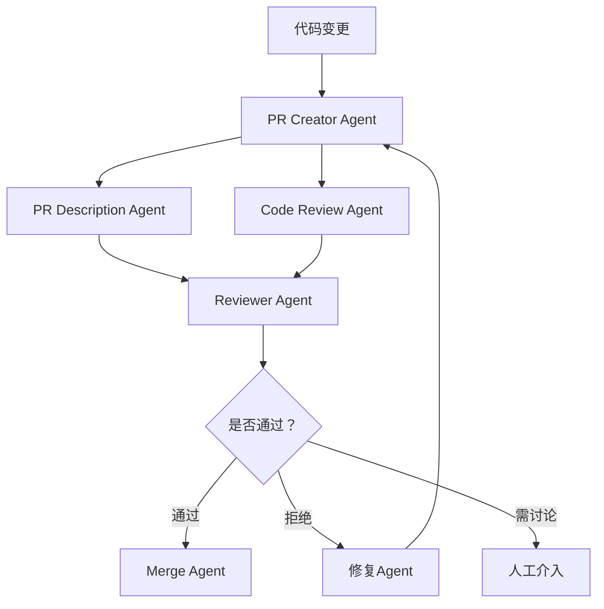
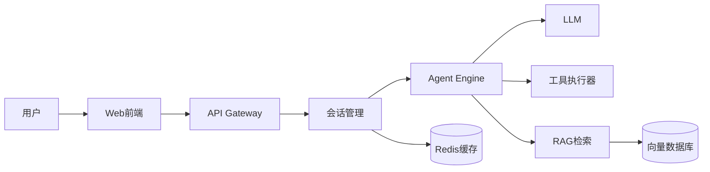
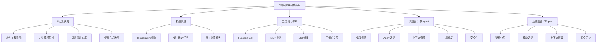

## 📋 目录

1. [AI认知与宏观思考](#1-AI认知与宏观思考)
2. [模型基础原理](#2-模型基础原理)
3. [工具调用体系（FC/MCP/Skill）](#3-工具调用体系)
4. [系统设计：多Agent自动PR系统](#4-系统设计多Agent自动PR系统)
5. [系统设计：单Agent类GPT Web应用](#5-系统设计单Agent类GPT-Web应用)
6. [六大核心技术方向](#6-六大核心技术方向)
7. [知识点图谱](#7-知识点图谱)

---

## 1️⃣ AI认知与宏观思考

**Q2：你觉得AI的出现对软件工程的影响是什么？**
- 🔑 **考察点**：对AI颠覆性影响的技术视野
- 💡 **思路**：
  - **开发效率**：代码生成、调试辅助、文档自动化，开发速度提升50%+
  - **角色转变**：从"写代码"到"设计+审查"，工程师更侧重架构与质量把控
  - **质量保障**：AI生成代码需要更严格的Review与测试覆盖
  - **工程规范**：需要建立AI生成代码的规范与最佳实践
  - **新岗位涌现**：Prompt Engineer、AI质检、Agent架构师

**Q3：你怎么看待古法编程？**
- 🔑 **考察点**：对技术演进的开放态度与辩证思考
- 💡 **思路**：
  - **理性看待**：古法编程（手写全部代码）在理解底层原理、精确控制性能方面仍有价值
  - **效率权衡**：AI辅助下，"古法"不再是唯一选择，但完全依赖AI可能丧失调试能力
  - **学习路径**：学习阶段需要"古法"打基础，生产阶段应善用AI提效
  - **实际现状**：大厂99%已用AI Coding，回不去了，但核心逻辑仍需人工把关

**Q4：低级语言到高级语言，与高级语言到自然语言为什么不能简单类比？**
- 🔑 **考察点**：对编程语言演进本质的深刻理解
- 💡 **思路**：
  - **低级→高级**：抽象层次提升，但仍保留**确定性**和**可执行性**（编译/解释后精确运行）
  - **高级→自然语言**：自然语言具有**模糊性**、**歧义性**、**上下文依赖**，LLM的生成结果不可100%保证正确
  - **核心差异**：编译器是确定的（相同输入→相同输出），LLM是概率的（相同prompt→不同输出）
  - **本质**：自然语言编程不是"编译"，而是"翻译+生成"，需要额外的验证层

**Q4延伸：AI对学习的影响是什么？**
- 🔑 **考察点**：AI时代的学习方法
- 💡 **思路**：
  - **正面**：降低入门门槛、个性化学习路径、即时答疑
  - **负面**：过度依赖削弱基本功、思维固化（只抄不思考）
  - **最佳实践**：AI作为"导师"而非"代写"，先独立思考再AI辅助验证

## 2️⃣ 模型基础原理

**Q5：什么是大模型的温度（temperature）？**
- 🔑 **考察点**：LLM核心参数理解
- 💡 **思路**：
  - **定义**：控制输出随机性的参数，范围0-2（常用0-1）
  - **原理**：影响softmax概率分布的平滑度，温度越高→概率分布越均匀→输出越多样；温度越低→概率分布越尖锐→输出越确定
  - **数学**：$P_i = \frac{e^{z_i/T}}{\sum_j e^{z_j/T}}$，T=温度

**Q6：你平时会调整温度这个参数吗，什么场景？**
- 🔑 **考察点**：实际调参经验
- 💡 **思路**：
  - **低温度（0-0.3）**：代码生成、数学推理、事实问答 → 需要确定性
  - **中温度（0.3-0.7）**：文案写作、翻译 → 适度多样性
  - **高温度（0.7-1.0）**：创意生成、头脑风暴 → 需要探索性
  - **实际案例**：
    - Agent工具调用：T=0.1（必须精确匹配函数签名）
    - RAG问答：T=0.2（基于事实回答）
    - 文案生成：T=0.7（需要多样性）

## 3️⃣ 工具调用体系

**Q8：Function Call、MCP、Skill区别？**
- 🔑 **考察点**：Agent工具调用体系的理解深度
- 💡 **思路**：

| 维度 | Function Call | MCP (Model Context Protocol) | Skill |
|------|--------------|------------------------------|-------|
| **定位** | LLM原生工具调用接口 | 标准化工具协议 | 业务能力封装单元 |
| **粒度** | 细粒度（单个函数） | 中粒度（一组相关能力） | 粗粒度（完整业务流程） |
| **协议层** | API调用级 | 通信协议级 | 业务抽象级 |
| **标准化** | 各模型厂商各自实现 | 开放标准协议 | 平台/团队自定义 |
| **组合性** | 单一调用 | 可组合多个工具 | 可嵌套编排 |

- **关系**：Skill 内部可调用多个 FC/MCP，MCP 提供标准化访问 FC 的通道

**Q9-10：讲讲你用过的skill / 你平时写skill吗？**
- 🔑 **考察点**：实际Agent开发经验
- 💡 **思路方向**：
  - 文档解析Skill（PDF/Word/代码库）
  - 代码审查Skill（Review + 建议生成）
  - 测试生成Skill（单元测试/集成测试）
  - 知识检索Skill（RAG + 向量数据库）
  - 数据处理Skill（ETL/格式转换）

## 4️⃣ 系统设计：多Agent自动PR系统

**Q11：系统设计 - 多Agent自动PR系统**

> 🎯 **场景**：多个Agent协作完成Pull Request的创建、审查、合并全流程

### 核心架构



### 核心模块

| Agent | 职责 | 关键技术 |
|-------|------|---------|
| **PR Creator** | 分析diff，生成PR结构 | 代码diff分析 + 变更类型分类 |
| **Description Agent** | 写PR描述、变更日志 | LLM生成 + 模板填充 |
| **Code Review Agent** | 代码质量检查 + Bug检测 | 静态分析 + LLM推理 |
| **Reviewer Agent** | 综合判断是否合入 | 多维度评分 + 规则引擎 |
| **Merge Agent** | 合并策略执行 | Git操作自动化 |
| **修复Agent** | 根据review建议修复代码 | 代码生成 + 补丁应用 |

### 关键设计要点

**a) 沙箱机制实现**
- 每个Agent运行在**独立沙箱**（Docker容器/nsjail）
- 资源限制：CPU/内存/网络隔离
- 文件系统：只读基础镜像 + 临时可写层
- **安全策略**：
  - 禁止外网访问（除非白名单）
  - 禁止系统调用黑名单（mount/reboot等）
  - 超时强制销毁（如5min）
  - 操作审计日志落盘

**b) Agent之间的通信**
- **方案对比**：

| 方案 | 优点 | 缺点 | 适用场景 |
|------|------|------|---------|
| 消息队列 (RabbitMQ/Kafka) | 异步解耦、削峰填谷 | 延迟增加 | 跨服务通信 |
| 共享黑板 (Redis) | 实时共享、状态可见 | 数据一致性需保障 | 协作式任务 |
| gRPC双向流 | 低延迟、强类型 | 复杂度高 | 需要实时交互 |
| 事件总线 (Event Bus) | 松耦合、可扩展 | 事件追踪难 | 事件驱动架构 |

- **推荐**：主链路用消息队列 + 状态共享用Redis黑板

**c) 上下文管理**
- **PR全局上下文**：diff内容、commit history、关联issue、CI状态
- **Agent局部上下文**：当前review焦点、已发现的问题列表
- **持久化**：每个PR独立上下文快照，支持历史回溯
- **更新策略**：增量更新（只传变更部分）+ 过期清理

**d) 工具的触发与调用**
- 触发条件：git push / PR create / comment @agent
- 调用链：事件 → 路由 → 触发对应Agent → 调用工具
- 工具类型：Git API / 静态分析 / 单元测试 / 代码生成
- 结果反馈：工具执行结果写回上下文，供下一步决策

**e) 安全性**
- **代码安全**：沙箱内执行，防止恶意代码溢出
- **权限控制**：Agent最小权限原则（只读+指定操作）
- **审计**：所有Agent操作记录不可篡改日志
- **熔断**：异常Agent自动隔离，不影响主流程
- **人工闸门**：关键步骤（合并主干）需人工确认

## 5️⃣ 系统设计：单Agent类GPT Web应用

**Q12：系统设计 - 单Agent类GPT Web应用**

> 🎯 **场景**：类似ChatGPT的Web应用，具备对话 + 工具调用 + 知识检索能力

### 核心架构



### 六大核心技术方向详解

#### a) 沙箱机制的实现

**为什么需要沙箱？**
- 用户/Agent执行的代码可能有恶意行为
- 工具调用可能消耗过多资源
- 隔离不同租户的会话数据

**实现方案：**
1. **进程级沙箱**：每个会话一个轻量进程/容器
   - 优点：强隔离
   - 缺点：资源开销大
2. **语言级沙箱**：Pyodide（浏览器Python）/ WebAssembly
   - 优点：轻量、快速启动
   - 缺点：能力受限
3. **系统调用过滤**：seccomp/AppArmor
   - 优点：细粒度控制
   - 缺点：配置复杂

**推荐组合**：进程级隔离 + 系统调用过滤 + 资源配额

#### b) Agent之间的通信

**单Agent场景通信要点：**
- **内部模块通信**：Event Bus / 回调机制
- **LLM ↔ 工具**：Function Call协议（JSON Schema描述）
- **LLM ↔ 记忆**：向量检索 + 缓存查询
- **前端 ↔ 后端**：SSE流式输出 + WebSocket双向通信

#### c) 上下文的管理

**上下文层级：**
```
Global Context (系统级)
  └── Session Context (会话级)
       └── Turn Context (单轮对话)
            └── Tool Context (工具调用)
```

**管理策略：**
- **窗口滑动**：保留最近N轮对话
- **摘要压缩**：超出窗口时LLM生成历史摘要
- **关键信息持久化**：用户偏好、重要结论存入长期记忆
- **上下文预算**：按token数管理（如保留4K tokens上下文）

#### d) 工具的触发与调用

**触发机制：**
1. **显式触发**：用户@tool_name 或 选择工具
2. **隐式触发**：LLM自动判断需要调用工具（Function Calling）
3. **路由规则**：基于意图分类 + 关键词匹配

**调用流程：**
```
用户输入 → 意图识别 → 匹配工具 → 参数填充
→ LLM确认 → 沙箱执行 → 结果返回 → LLM整合响应
```

**安全性校验**：
- 参数Schema校验
- 敏感操作二次确认
- 频率限制（Rate Limit）
- 结果安全过滤（脱敏/内容审核）

#### e) 安全性

| 维度 | 风险 | 应对措施 |
|------|------|---------|
| **Prompt注入** | 恶意prompt绕过安全限制 | 输入过滤 + 系统prompt加固 |
| **数据泄露** | 敏感信息被LLM输出 | 输出脱敏 + PII检测 |
| **工具滥用** | 频繁调用消耗资源 | 配额限制 + 熔断机制 |
| **会话劫持** | token泄露模拟用户 | JWT短时效 + 设备指纹 |
| **模型偏见** | 输出不当内容 | 安全分类器 + 内容审核 |

## 6️⃣ 六大核心技术方向汇总

| 方向 | 核心问题 | 关键方案 | 难度 |
|------|---------|---------|------|
| 🏖️ **沙箱机制** | 代码执行隔离、资源控制 | Docker/nsjail + seccomp + 配额 | ⭐⭐⭐⭐ |
| 📡 **Agent通信** | 数据传输、协议选型 | 消息队列 + Redis黑板 + gRPC | ⭐⭐⭐ |
| 📚 **上下文管理** | 窗口有限、信息遗忘 | 滑动窗口 + 摘要压缩 + 持久化 | ⭐⭐⭐ |
| 🔧 **工具触发调用** | 意图匹配、参数填充 | Function Call + Schema校验 + 路由 | ⭐⭐⭐⭐ |
| 🛡️ **安全性** | Prompt注入、数据泄露 | 过滤 + 审计 + 配额 + 脱敏 | ⭐⭐⭐⭐⭐ |

## 7️⃣ 知识点图谱



---

## 💡 核心考点总结

| 考察方向 | 重点内容 | 与Cider面经互补点 |
|---------|---------|-----------------|
| AI认知 | 技术视野、思辨能力 | Cider偏实战，B站偏宏观 |
| 温度参数 | 原理 + 调参经验 | 基础模型理解，Cider未涉及 |
| 工具体系 | FC/MCP/Skill三者关系 | 更体系化的工具认知 |
| 沙箱机制 | 隔离实现 + 资源控制 | **Cider未涉及，B站独有** |
| 安全性 | Prompt注入 + 数据防护 | **Cider未涉及，B站独有** |

> 📌 **一句话总结**：**Cider面经的完美互补**——如果说Cider聚焦"Agent如何跑得快、跑得稳"，B站这篇则聚焦"Agent如何跑得安全、跑得规范"。沙箱隔离、安全防护、宏观认知三大独有视角，让Agent知识体系更加完整！
