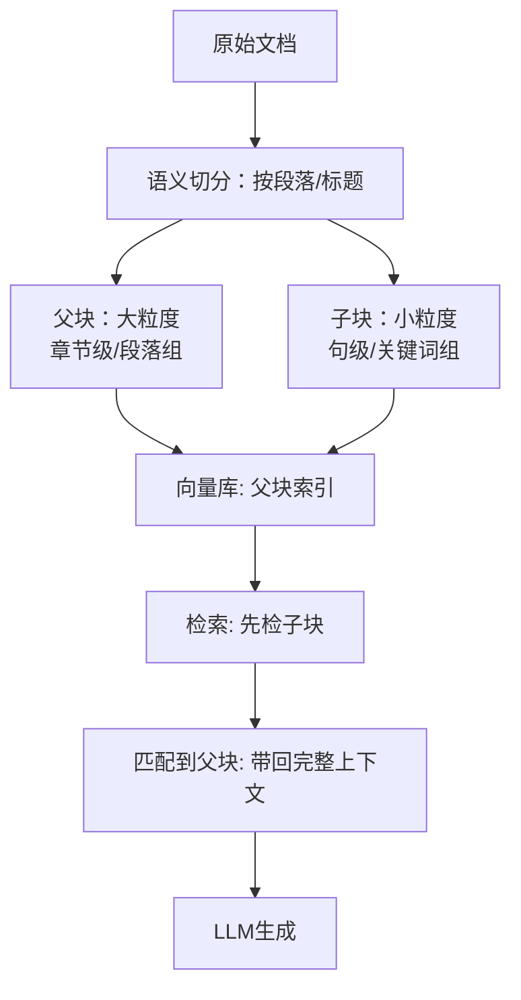

## 一、🏢 字节跳动 · 特色题（7 题）

---

### 题1：为什么要自己搞 code agent？挑战是什么？

**参考回答（面试口语化）：**

自己做 code agent 的动机，核心是**"现有的方案不能完全解决我的问题"**。

市面上的 code agent（比如 Claude Code、Cursor、Copilot）都是通用方案，它们的问题在于：① 对特定业务代码的上下文理解不够——我用的框架、项目结构、编码规范，这些通用工具不知道；② 在复杂任务场景下，通用方案的行动规划不够精细，容易偏离目标；③ 缺少和内部系统的对接能力——CI/CD 集成、内部 API 调用、公司级别的编码规范校验。

自己做 code agent 的好处——我可以精确地定义 Agent 的能力边界，让它只做它能做好的事情。比如帮我做代码审查、自动化重构、按业务模板生成代码。同时我可以把公司的最佳实践、代码规范注入到 agent 的 system prompt 和工具定义里，让它"懂我们的玩法"。

**挑战**最大的几个：
1. **评估难**——不是所有场景都能自动化评测，有些需要人工判断
2. **边界把控**——Agent 执行太激进可能出问题（比如改坏了不该改的代码），太保守又没用
3. **异常处理**——代码修改过程中各种报错、依赖问题，Agent 能不能自己兜住
4. **和现有工作流集成**——不让开发者觉得"多个东西要学"

> **加分回答关键**：不要只说"我想做一个 code agent"，要说清楚"为什么通用的不够用"、"你的 agent 解决了什么通用方案解决不了的问题"。

---

### 题2：Claude Code 源码泄漏有关注吗？有什么看法？

**参考回答（面试口语化）：**

有关注，Claude Code 源码里有几个值得学习的设计：

一是它的 **Prompt 结构** ——非常精细的分块管理，系统指令、工具定义、任务描述、上下文历史的边界非常清晰，每个模块有独立的版本号。

二是它的 **工具设计范式** ——工具的粒度和 Schema 定义很均衡，没有特别大的"全能工具"也没有碎成一地的小工具。每个工具的描述都经过精心设计，让模型能准确理解它的用途。

三是它的 **错误恢复机制** ——不是简单重试，而是根据错误类型做不同的兜底策略。编译报错、语法错误、运行时异常，处理方式都不一样。

我的看法是：Claude Code 代表了目前 code agent 的最高水平，但它的架构设计并不能直接复制到每个场景——它针对的是通用代码场景，业务代码场景需要做大量适配。而且它的 token 消耗策略偏重，对成本敏感的场景不太友好。

> **加分回答关键**：体现"技术视野"——你看过，而且有自己的判断，不是简单地"说好"或"说坏"。

---

### 题3：同一个模型不同 context 长度下表现差异？

**参考回答（面试口语化——上下文工程实践）：**

这是一个非常好的工程问题，实际测试下来差异很大。

**短上下文（<4K）**：模型表现最稳定、指令遵循度最高、幻觉率最低。因为上下文里没有冗余信息，模型专注于用户指令。但坏处是 Agent 只能处理简单的单步任务。

**中等上下文（4K-32K）**：模型能处理多步推理和工具调用，但开始出现"注意力稀释"——重要信息在长文本里，模型可能忽略。这个区间的表现跟 prompt 结构关系最大——关键指令放开头和结尾，中间放工具定义和上下文。

**长上下文（32K-128K+）**：性能明显下降，表现为：① 召回率下降——模型在长文本中定位信息的能力变弱；② Agent 规划走偏——历史太长导致 Agent 忘了当前目标；③ Token 成本飙升——一个大任务可能烧掉几万 token。

**我的实践结论**：不要因为模型宣称支持 128K 上下文，就真的塞满 128K。实际测试 8K-16K 是最佳工作区间。长了就用压缩或截断，不要硬塞。

> **面试加分**：能用实际数据说话最佳，比如"我们测试过 4K/8K/16K/32K 四个档位，8K 时 F1 最高，32K 时下降了 15%……"

---

### 题4：项目里有什么工具？

**参考回答（面试口语化——项目真实性验证题）：**

这个问题面试官的核心目的是**验证项目的真实性**，所以最好提前列好工具清单，每个工具说清楚：

- **工具名称**：比如 search_code、analyze_dependency、run_tests
- **输入输出**：参数是什么，返回什么
- **设计考量**：为什么设计成这个粒度、为什么参数这么定义
- **使用频率/场景**：哪些工具在哪个场景下被调用

示例："我们项目里有五个核心工具——search_code（语义搜索代码库）、get_file_content（获取文件内容）、run_python（执行代码片段验证逻辑）、analyze_dependency（分析模块依赖关系）、commit_change（应用代码修改并提交）。其中 search_code 和 get_file_content 使用最频繁，几乎每步都会调用；run_python 用于验证，保障修改不破坏逻辑。"

> **核心**：讲工具不是在念清单，而是让面试官感觉你真的设计过、用过、观察过工具的使用情况。

---

### 题5：有没有用过 Claude Code 的 /btw 功能？

**参考回答（面试口语化）：**

/btw（by the way）是 Claude Code 里一个挺有意思的交互功能——用户在任务执行过程中可以穿插额外的指令，Agent 需要在不中断主任务的情况下处理这些"顺便"的需求。

用过。这功能背后涉及的是 Agent 的**多目标管理**能力——Agent 需要：① 记住当前主任务的状态；② 把穿插的额外需求变成子任务或待办；③ 执行完子任务后回到主任务不丢失上下文。

技术上实现这个效果，需要在 memory 设计里加入"待办列表"的概念——主任务状态 + 额外需求队列 + 优先级排序。Agent 每完成一个子步骤，检查待办列表，决定下一步做什么。

> **加分回答关键**：面试官问的不是"你用没用过"，而是"你理解这个功能背后的技术设计吗"。

---

### 题6：整个项目中 AI coding 的占比？

**参考回答（面试口语化——角色定位判断题）：**

这个问题的关键在于**区分"AI coding 帮你写的代码量"和"你自己的设计投入"**。

如实回答更可靠。如果项目主要靠自己设计，AI 主要在辅助编码层面（代码补全、单元测试生成、文档生成），就说清楚：比如"项目核心架构和算法逻辑是自己设计的，AI 主要在 30% 的 boilerplate 代码和 20% 的测试用例生成上发挥了作用"。

面试官真正想听的是：**你有没有脱离 AI 的设计判断力，还是完全依赖 AI。**

> **加分回答**："AI coding 帮我提升了开发效率，但核心的架构设计、工具定义、异常处理策略都是我自己做的——这些才是 agent 质量的决定因素，AI 做不了。"

---

### 题7：什么是好的 code agent 应具备的特质？

**参考回答（面试口语化——开放题，体现认知高度）：**

一个好的 code agent，我总结几个核心特质：

**① 精确的上下文理解**——不只是能看懂代码，还要理解代码结构、依赖关系、项目规范。比如在重构时，它要知道改了 A 会不会影响 B。

**② 安全的执行边界**——code agent 可以改代码，但不能乱改。它需要有"安全区"的概念——哪些文件能改、哪些不能改、改完之后要做验证。好的 code agent 会先分析风险再动手。

**③ 良好的纠错能力**——代码不可能一次改对。改了之后编译报错 / 测试失败，Agent 能不能自己定位问题、再次尝试？好的 code agent 能识别错误类型做针对性修复。

**④ 可观测性**——每一步做了什么、为什么这么做、结果是什么，全链路记录。开发者要能复盘整个执行过程。

**⑤ 渐进式复杂度**——简单的代码改动快速完成，复杂的重构逐步推进。不是所有问题都要走一遍完整规划。

> **面试加分**：把"特质"映射到具体的技术实现，比如"安全的执行边界 → 工具定义的只读/读写属性 + 执行前的预检查 + 变更后的测试验证"。

---

## 二、🏢 阿里淘天 · 特色题（8 题）

---

### 题1：会话压缩怎么做的？长期记忆写入时机？

**参考回答（面试口语化——阿里必问深水区）：**

**会话压缩怎么做：**
我们在上下文快到 80% 限制时触发压缩。具体流程——用模型对当前上下文生成结构化摘要，保留：系统指令（不改动）、关键决策记录、已收集的重要信息、用户核心需求、当前任务进度。丢弃：中间重复推理过程、低价值的工具返回日志、冗余对话轮次。压缩完成后用摘要替代原始上下文，节省 token 空间。

**长期记忆写入时机**，可以总结为三种触发条件：
1. **任务完成**——当前任务结束后，用 LLM 对整个过程做摘要，提取关键信息存入长期记忆
2. **用户明确指示**——用户说"记住这个配置"或"下次别用这个方案了"，直接触发写入
3. **重要信息出现**——Agent 自身判断：某条信息对后续交互可能有价值（比如用户说了"我习惯代码用空格缩进"），触发重要性打分+去重后写入

> **加分回答关键**：不是所有信息都值得存，写入前要做"重要性评估 + 去重判断"。

---

### 题2：上下文结构怎么组织的？长度约束策略？

**参考回答（面试口语化）：**

上下文结构按优先级排序，从高到低：
```
1. 系统规则 / 核心约束（不可覆盖）
2. 当前轮用户输入（最高优先级指令）
3. 工具调用结果 / 知识库检索结果（当前任务相关）
4. 短期记忆 / 历史对话摘要（精简后的）
5. 用户长期偏好（soft hint，不覆盖当前事实）
```

**长度约束策略：**

不依赖模型的最大上下文限制，我们主动设定一个**工作上限**——比如 16K token。策略是：
- 超了就**压缩**（摘要替换历史）
- 再超就**截断**（保留起始的系统指令和结尾的最新交互）
- 还超就**拒绝**（提示用户当前任务太复杂，建议拆分成子任务）

> **加分回答关键**：最好有实际数字，"我们现在线上 Agent 平均每次推理的上下文大小控制在 8K-12K，超过 16K 触发压缩，超过 24K 触发截断"。

---

### 题3：agent.md vs memory.md vs skills.md 职责区分？

**参考回答（面试口语化——架构理解关键题）：**

这三个文件是阿里淘天架构中非常核心的设计，职责清晰：

**agent.md（Agent 定义）**
定义 Agent 是谁、做什么、怎么行为。相当于系统 prompt + 行为规则。包含了 Agent 的角色描述、核心能力说明、行为约束、输出格式要求。这是 Agent 的"人格文件"。

**memory.md（记忆文件）**
存储跨会话的长期记忆——用户偏好、历史交互摘要、已学习的信息。它不是对话日志，而是经过提取、摘要、结构化的知识沉淀。每次会话结束后更新。

**skills.md（技能文件）**
注册 Agent 可复用的能力模块。每个 skill 是一个独立的能力包——包含触发条件、执行流程、工具定义。Skill 可以被其他 Agent 共享，是"可复用能力"的载体。

**三者的关系**：agent.md 告诉 Agent "你是谁"；memory.md 告诉 Agent "你记得什么"；skills.md 告诉 Agent "你会什么"。三者一起构成 Agent 的完整配置。

> **面试加分**：用工程类比——agent.md = 配置文件，memory.md = 持久化数据库，skills.md = 可插拔模块。

---

### 题4：工具和 skill 位置交换的后果？

**参考回答（面试口语化——架构权衡深度题）：**

这个问题非常犀利，属于阿里淘天专属深水区题，考察的是对**架构设计原理**的理解。

如果把工具放到 skill 的位置，或者把 skill 放到工具的位置，会出现一系列问题：

**工具放到 skill 位置：**
- 工具是原子级的操作（搜索文件、读文件、写文件），放到 skill 层会让系统把"一个文件操作"当作"一个完整能力"来管理
- 后果：系统需要维护大量细粒度的 skill（比如几百个 skill），检索和管理成本飙升
- 同时 Agent 在处理复杂任务时，每次都要从几百个 skill 里选"下一个读文件用哪个"，效率极低

**skill 放到工具位置：**
- Skill 是组合能力（比如"分析一个项目依赖并生成报告"），放到工具层会让 Agent 决策时面对的都是"大操作"
- 后果：模型不敢轻易调——因为每个"工具"都太重量级了，调错了代价很大
- 同时也失去了原子操作的灵活性，Agent 只能做预定义好的组合动作

**正确的关系**：
```
工具层（原子操作） → Skill 层（组合能力） → Agent（任务级决策）
工具是积木，Skill 是拼好的组件，Agent 用组件完成整体任务。
```

层次乱了，整个系统的灵活性和可维护性都会出问题。

---

### 题5：怎么看 AI？平时怎么用 AI 工具？

**参考回答（面试口语化——综合考察）：**

这个问题表面是聊天，实际在考察**你对 AI 的生产力认知深度**。

建议从三个层次回答：
1. **日常辅助**：代码补全、问答搜索、文档生成 — "AI 帮我省了 30% 的 boilerplate 工作时间"
2. **深入使用**：设计讨论、代码审查、方案对比 — "我会把不同方案丢给 AI 做 trade-off 分析，让它帮我找出盲点"
3. **批判性使用**：知道 AI 的边界 — "对生成结果保持怀疑，关键逻辑要自己验证，不盲信"

> **加分回答关键**：不要只说"好用"，要体现出"有意识的、批判性的使用习惯"。

---

### 题6：如果要从 Skill 升级为 AI Agent，关键设计点？

**参考回答（面试口语化——架构演进能力）：**

这个题考的是**你有没有系统设计思维**。

Skill → Agent 升级，关键设计点：
1. **增加规划能力**——Skill 是按固定流程执行的，Agent 需要能动态拆解任务、制定执行计划
2. **增加记忆系统**——Skill 无记忆，Agent 需要短期/长期记忆来管理上下文
3. **增加自主决策**——Skill 执行完就结束了，Agent 需要能判断"任务完成了吗"、"下一步做什么"
4. **增加异常处理**——Skill 过程出错就报异常，Agent 需要兜底
5. **增加反馈循环**——Agent 需要能根据执行结果调整后续行为

一句话总结：**Skill 是"按剧本演戏"，Agent 是"即兴表演但能即兴收场"**。

---

### 题7：Agent 输出不稳定，优先排查哪些方面？

**参考回答（面试口语化——工程排查思路）：**

输出不稳定的时候，按这个优先级排查：

1. **先看 System Prompt 是否变化**——Prompt 没版本管理？上次改了什么？很多时候输出不稳就是改了 prompt 没注意到
2. **再看工具调用链路**——模型选错工具了？工具返回数据变了？API 返回内容改了导致模型决策不同？
3. **再看上下文结构**——上下文里是不是塞了不该塞的东西？检索结果有噪音导致模型被误导？
4. **最后看模型版本**——API 模型有没有自动升级版本？有时候稳定性问题是模型厂商那边改的

> **加分回答关键**：不要一上来就说"改 prompt"，要有一条清晰的排查路径。

---

### 题8：OpenClaw 核心解决什么问题？边界和局限在哪？

**参考回答（面试口语化——技术视野）：**

OpenClaw 核心解决的是 **Agent 的上下文效率和稳定性问题**。它的核心思想是——不让无关的上下文信息干扰 Agent 的执行，通过结构化压缩、重要性评分、动态注入来优化上下文质量。

**边界和局限：**
1. **强依赖 LLM 的压缩能力**——压缩质量不行，上下文质量就跟着下降
2. **压缩本身有成本**——每次压缩都需要一次 LLM 调用，对延迟敏感场景不友好
3. **无法完全避免信息丢失**——压缩是摘要，总会有细节丢失
4. **配置复杂**——很多参数需要根据具体场景调

> **加分回答关键**：不盲目吹捧，客观分析"解决了什么问题"和"还有什么问题没解决"。

---

## 三、🏢 腾讯 · 特色题（5 题）

---

### 题1：什么是 Agent / RAG / Prompt Engineering？（一面概念题）

**参考回答（面试口语化——腾讯一面概念题）：**

腾讯一面会先确认你对基础概念的理解是否扎实。

**Agent**：以 LLM 为大脑、能自主规划、调用工具、管理记忆、多步推理循环的智能系统。和普通 LLM 应用的区别——LLM 是被动的"问→答"，Agent 是主动的"目标→规划→执行→反馈"。

**RAG（检索增强生成）**：把外部知识库通过检索注入到 LLM 的上下文中，让 LLM 在回答时有所依据，而不是只靠模型内部知识。核心链路：查询 → 检索（向量/关键词）→ 重排序 → 注入上下文 → LLM 生成。

**Prompt Engineering**：通过设计输入提示来引导 LLM 行为的技术。包括角色设定、指令约束、示例注入、输出格式规范等。核心是让模型"不需要猜"——你给的信息越精确，模型输出越可控。

> **回答技巧**：腾讯一面题虽然基础，但要在基础中体现深度。每个概念最后加一个"实战理解"——你在项目中怎么用的。

---

### 题2：Planner 怎么设计？（二面系统设计）

**参考回答（面试口语化——腾讯二面系统设计）：**

Planner 是 Agent 的"大脑"，负责把用户需求分解成可执行的步骤序列。

我的设计方案分三层：

**第一层：任务分解**
用户输入后，Planner 判断任务类型（简单/复杂/需规划），简单任务直接走工具调用，复杂任务走分解流程。分解时用 CoT（Chain-of-Thought）逐层拆解——大目标→子目标→子任务→步骤。

**第二层：执行调度**
分解出步骤后，Planner 需要决定步骤执行顺序（串行/并行）、依赖关系（B 依赖 A 的结果？）、重试策略（失败了换条路试？）。

**第三层：动态重规划**
执行过程中可能出现预料之外的情况——工具返回结果和预期不符、某个步骤无法完成。Planner 需要能基于当前状态重新规划，不是从头开始，而是从"已完成的步骤"基础上调整。

> **加成回答关键**：强调"Planner 不是一次规划完就不管了，是动态的"。

---

### 题3：上下文优先级怎么排？

**参考回答（面试口语化——二面设计权衡）：**

上下文优先级从高到低：
```
1. 系统规则 / 约束 / 安全限制（最高优先级，不可覆盖）
2. 当前轮用户输入（用户说了什么）
3. 工具执行结果（当前任务最相关的信息）
4. 历史对话摘要（压缩后的）
5. 长期记忆中的用户偏好（soft hint，可以覆盖但要有依据）
```

关键在于**处理冲突**——用户的当前输入和长期记忆冲突时，以当前输入为准。比如用户之前说过"用 markdown 格式回复"，但这次说"纯文本就好"，那当前输入覆盖长期记忆。

---

### 题4：可审计 Agent 怎么设计？

**参考回答（面试口语化——二面系统设计）：**

可审计 Agent 的目标是三个：**能追责、能定因、能复现**。

审计需要记录的内容：
1. **全链路日志**：用户输入、系统 prompt 版本、工具候选集、模型选择结果、工具调用参数+结果、Agent 输出、最终结果
2. **状态快照**：每步后的上下文基线，方便回溯
3. **决策轨迹**：Agent 每一步的思考过程（ReAct 的 Thought 层），不只是结果

**数据结构**：每个请求一个 Request ID（trace_id），每步一个 Step ID，父子关系结构化存储。

**复现条件**：有了完整的输入 + prompt 版本 + 工具定义 + 模型版本，理论上就能复现 Agent 行为。

> **加分回答关键**：讲清楚"为什么要可审计"——生产环境出问题时，没有审计日志你连怎么死的都不知道。

---

### 题5："为什么不这么做"层面的追问

**参考回答（面试口语化——腾讯特色深追问）：**

这个问题是腾讯面试的核心特色——**面试官不只问"你怎么做的"，更追问"为什么不这么做"**。

应对策略是：**每个技术选型都要准备 2-3 个备选方案 + 选这个的理由**。

示例：
- 为什么用 RAG 而不是微调？ → 因为知识更新频繁，微调成本高且数据变化快
- 那为什么不上 RAG 而是用微调？ → 因为回答风格一致性要求高，RAG 检索的变化会导致回答差异大，用户感知不稳定
- 为什么用 MCP 而不是直接 Function Calling？ → 因为 MCP 标准化、Server 级隔离、工具动态发现。但如果项目只有 2-3 个简单工具，Function Calling 更轻量

> **核心**：你的每个"为什么"后面，都要有一个"如果是相反情况，我会选另一个方案"的认知。

---

## 四、🏢 滴滴 · 特色题（6 题）

---

### 题1：MCP 怎么运作的？有哪些协议？区别？

**参考回答（参考文档已覆盖——详见《核心模块篇》题7-10）：**

MCP（Model Context Protocol）采用 Client-Server 架构：LLM ↔ MCP Client ↔ MCP Server ↔ 外部数据源/工具。

**通信协议**：目前支持 STDIO（本地子进程管道，低延迟）和 SSE（远程 HTTP 推送，可云端部署）。未来可能支持 WebSocket。

**具体区别已在核心模块篇详细回答，此处摘要**：
| 维度 | STDIO | SSE |
|------|-------|-----|
| 通信方式 | 子进程标准输入输出 | HTTP SSE 推送 |
| 部署位置 | 仅本地 | 本地/云端 |
| 延迟 | 极低 | 有网络开销 |
| 适用 | 开发调试 | 生产环境 |

---

### 题2：MCP 怎么处理并发调用？

**参考回答（已在核心模块篇题8详细回答）：**

Server 侧并行处理 + 请求排队；Client 侧只读工具可并行、读写工具串行化；工具定义标注幂等性，Client 根据标注决定并发策略；大结果做截断防止阻塞链路。

---

### 题3：MCP 和 Skill 区别？

**参考回答（面试口语化——高频混淆点）：**

这是滴滴面试高频混淆题，一定要分清**粒度不同、定位不同**。

| 维度 | MCP | Skill |
|------|-----|-------|
| **定位** | 标准化工具调用协议 | 封装好的任务级能力包 |
| **粒度** | 单工具（读文件、搜索、计算） | 组合能力（分析代码、生成报告） |
| **复用性** | 跨平台通用（业界标准） | 平台特定，跟 Agent 配置绑定 |
| **关系** | 可被 Skill 内部调用 | 可组合多个 MCP 工具 |

**一句话区分**：MCP 是"怎么调"（如何暴露和调用工具），Skill 是"做什么"（封装了一个完整的能力）。

---

### 题4：你对 AI coding tools 了解多少？

**参考回答（面试口语化——技术视野题）：**

目前主流的有几个类别：
- **IDE 内嵌型**：GitHub Copilot、Amazon CodeWhisperer、Codeium —— 代码补全、行内建议
- **独立 Agent 型**：Claude Code（Coding Agent）、Cursor（AI-native IDE）、Devin（全自主开发 Agent）
- **框架/协议型**：LangChain 的 code agent 能力、MCP 的工具体系

我的理解是：AI coding tools 正在从"辅助编码"走向"辅助设计"。第一阶段是代码补全（Copilot），第二阶段是代码 Agent（Claude Code 能自己改代码、跑测试），第三阶段是全流程 Agent（Devin 做需求分析→编码→部署）。现在处于二阶段到三阶段的过渡期。

> **加分回答关键**：不要只是报菜名，要有自己的判断——"哪个方向我比较看好、为什么"。

---

### 题5：智能体三要素是什么？

**参考回答（面试口语化——Agent基础题）：**

智能体三要素通常指：
1. **感知（Perception）**——从环境中获取信息的能力，包括理解用户输入、读取系统状态、接收工具返回
2. **决策（Decision）**——基于感知到的信息，选择下一步做什么。包括规划、推理、反思
3. **行动（Action）**——执行决策的能力，包括工具调用、输出生成、状态变更

**也有另一种划分**：自主性、反应性、目标导向。两种都可以答，核心是表达出 Agent 不只是"被动响应"，而是"主动感知→决策→行动"。

> **回答技巧**：把三要素映射到你的项目里——"我们的 Agent 感知通过 XX，决策通过 XX，行动通过 XX"。

---

### 题6：两个机器人对话怎么实现？

**参考回答（面试口语化——多Agent通信）：**

两个机器人对话，核心是设计**消息传递机制**。我分几个层面来说：

**通信层面**：可以用消息队列（Redis/RabbitMQ）、HTTP 接口、或者共享存储（如数据库 / 文件）。推荐消息队列——异步、解耦、可审计。

**协议层面**：可以用 MCP（工具层级）+ A2A（Agent 层级）。MCP 让 Agent 能调用外部工具，A2A 让 Agent 能发现和与其他 Agent 通信。

**记忆层面**：两个 Agent **不直接访问对方记忆**，而是通过消息传递共享信息。Agent A 把需要共享的信息通过消息发送给 Agent B，Agent B 根据这些信息执行任务。

**实现关键**：① 消息格式要结构化（sender、receiver、content、intent、timestamp）；② 要有超时和重试机制——对方没响应就重试；③ 要做权限控制——不是所有 Agent 都能通信。

> **加分回答关键**：实际操作上，"我们用的方案是……，遇到的问题是……"。

---

## 五、🎯 通用高频追问型题目（8 题）

---

### 题1：这个设计你是怎么考虑的？有没有考虑过其他方案？

**参考回答（面试口语化——面试官最爱追问，无人能逃）：**

这个问题考察的是**技术选型能力**。回答结构建议用"A vs B"对比法：

"我们考虑过两种方案。方案 A 是 XX（特点：优点1、优点2），方案 B 是 XX（特点：优点1、优点2）。最终选了方案 A，原因有三——
1. 方案 A 在我们的场景下延迟更低（从 XX 降到 XX）
2. 方案 B 虽然功能更强，但复杂度高，团队维护成本大
3. 方案 A 能更好地和我们现有的 XX 系统集成"

**关键是**：不要说"没想过其他方案"；不要说"感觉方案A更好"——要用具体原因说服面试官。

---

### 题2：遇到过什么问题？怎么解决的？

**参考回答（面试口语化——区分"做过"和"看过"的关键题）：**

这个问题决定了面试官对你项目经验真实性的判断。推荐用"STAR 法则"回答：

**S（情境）**：项目上线一周后，发现 Agent 在某些场景下回答质量突然下降了 20%。
**T（任务）**：需要快速定位问题根因并恢复 Agent 回答质量。
**A（行动）**：排查路径：① 检查 Prompt 版本——没变过；② 检查模型版本——发现厂商自动升级了模型 API 版本，导致行为变化；③ 检查工具调用日志——工具返回的数据格式变了，模型解析失败导致后续操作出错。
**R（结果）**：锁定根因后，一方面回滚模型到旧版本，另一方面在我们的工具调用层加了格式校验，后续类似问题能提前发现。

---

### 题3：如果 XX 情况发生，系统会怎么样？

**参考回答（面试口语化——边界情况思考能力）：**

这种题没有标准答案，核心是**展示边界思考能力**。

回答策略：
1. **先分析场景**：明确 XX 情况发生的具体条件是什么
2. **再分层回答**：Agent 会怎么反应？提示用户？自动兜底？还是请求人类介入？
3. **最后给出防范**：我们在设计时考虑过这个情况吗？有没有做防呆设计？

示例："如果工具调用超时——Agent 会先重试一次；重试还失败就切换备用工具（如果有）；没有备用工具会记录错误、给用户一个友好提示（'正在处理中，遇到了点小问题，请稍候再试'）；同时上报异常到监控系统。我们在设计时已经做了三层兜底，所以系统不会崩——但确实还有优化空间，比如超时阈值的动态调整。"

---

### 题4：有量化的效果吗？

**参考回答（面试口语化——必须要有数据！）：**

**绝对不能回答"感觉好了很多"**。

量化的维度：
- **准确率/任务完成率**："优化前 66.7%，优化后 100%"
- **响应速度**："从平均 5s 降到 3s"
- **Token 成本**："上下文压缩后减少 40% token 消耗"
- **用户满意度**："NPS 从 6.2 提升到 8.1"

示例："我们做了上下文压缩和模型切换优化后，单次任务的平均 token 消耗从 8,500 降到 5,200（降了 38%），任务完成准确率从 72% 提升到 88%，用户平均等待时间减少了 1.8 秒。"

---

### 题5：为什么这么设计？Trade-off 是什么？

**参考回答（面试口语化——架构权衡能力）：**

这道题考察的是**你是否意识到设计没有完美方案，只有权衡**。

回答必须包含：
1. **我的选择**：我选了 A 而不是 B
2. **取舍**：选 A 得到了什么（收益），失去了什么（成本）
3. **为什么接受这个取舍**：因为在这个场景下，收益大于成本

示例："我们选择了 Plan-and-Execute 而不是 ReAct。Plan-and-Execute 有全局规划能力，不会跑偏，但代价是启动延迟更高（先规划再执行，比 ReAct 慢 1-2 秒）。我们接受这个取舍，因为项目的核心场景是复杂的代码重构任务——多等 1-2 秒可接受，但跑偏了导致改错代码不能接受。如果是实时聊天场景，我可能会选 ReAct。"

---

### 题6：做这个项目之前有没有看过成熟方案？差在哪？

**参考回答（面试口语化——技术视野+判断力）：**

这道题看你有没有**技术调研能力**——直接上手做，还是先看别人怎么做的。

回答结构：
1. **列出看过的方案**：Claude Code / LangChain / CrewAI / AutoGPT / 自研……（具体哪个）
2. **分析差异**：这些方案的优点、不足是什么
3. **你的判断**：为什么没用它们 vs 参考了它们的设计亮点

示例："做 code agent 之前，我深度看过 Claude Code 的源码文章和 LangChain 的 code agent 实现。Claude Code 的 prompt 结构设计非常强，但它的针对性太强——给通用场景设计的，对业务代码支持不够。所以我参考了它的工具设计范式和错误恢复策略，但规划器和工具定义都是根据我们项目的数据结构和编码规范重新设计的。"

---

### 题7：系统为什么不会失控？

**参考回答（面试口语化——稳定性设计理解）：**

这个问题翻译一下就是：**你怎么保证 Agent 不会把事情搞砸？**

我的回答从四个层面展开：
1. **输入层**——用户输入先校验，不合规的指令不执行
2. **决策层**——Agent 的每一步决策都有约束（System Prompt 的边界、工具 Schema 的参数校验）
3. **执行层**——工具调用做隔离（只读/读写权限分离），关键操作需要二次确认
4. **兜底层**——每一步都有超时保护、熔断机制、人类介入通道

"每个层面都不是完美的，但四个层面叠加在一起，能把失控概率压到极低。"

---

### 题8：上下文和 memory 到底怎么管？

**参考回答（面试口语化——Agent核心深水区）：**

上下文和 memory 的管理，核心是**分层 + 不同策略**：

**短期记忆（上下文窗口）**
- 当前对话的结构化管理：按优先级排内容（系统规则 > 用户输入 > 工具结果 > 历史摘要）
- 超长时：压缩（摘要替代原始内容）+ 截断（开头结尾保留）

**长期记忆（持久化存储）**
- 写入策略：任务完成时 / 用户明确指示 / 重要信息出现 → 重要性打分 → 向量化存储
- 检索策略：语义检索 + 时间衰减权重
- 使用策略：检索结果作为 soft hint 注入，不覆盖当前用户指令

**工作记忆（任务中间状态）**
- 当前正在执行的任务状态、子目标列表、已完成步骤
- 随执行过程维护，任务结束后清理

**三层的关系**：工作记忆最活跃（秒级更新）、短期记忆每次对话（分钟级）、长期记忆跨会话（天/周级）。

---


---

## 六、📕 小红书 · 特色题（1 题）

---

### 题1：怎么证明多Agent并行比串行更快？并行编排的风险怎么治理？

**参考回答（面试口语化——Cider面经高频深水区）：**

这个问题非常实战，面试官想听的不是"并行肯定快"，而是**你有没有真正跑过并行、踩过坑、拿到过数据**。

**第一步：怎么证明更快——用数据说话**

我会做A/B测试：同一组复杂任务分别跑串行和并行版本，监控两个核心指标：
- **TTFT（Time to First Token）**：首次token生成时间，反应系统的响应速度
- **总完成时间**：从任务下发到所有Agent全部完成

加速比公式：`加速比 = 串行总耗时 / 并行总耗时`

> 示例数据："在我们的场景下，3个Agent并行处理代码审查+测试生成+文档更新的复合任务时，串行耗时约24秒，并行耗时约9秒，加速比约2.7x。但加到5个Agent时加速比反而下降到2.1x，因为通信开销开始反超。"

**关键约束**：并行加速不是随Agent数线性增长的。子任务间必须是**无强依赖**关系才能并行。如果B依赖A的输出，强行并行只是在空转。

**第二步：并行编排的四大风险与治理方案**

| 风险 | 现象 | 治理方案 |
|------|------|---------|
| **资源竞争** | 多个Agent争抢同一个Tool/API | 资源池化 + 请求排队 + 乐观锁 |
| **状态不一致** | 并发写入导致数据覆盖 | 上下文隔离 + 每个Agent独立工作区 |
| **上下文漂移** | 共享上下文被污染，Agent互相干扰 | 读共享/写隔离 + 主Agent仲裁 |
| **成本失控** | 多Agent并行调用LLM导致token爆炸 | 限流 + 预算熔断 + 非核心走轻量模型 |

**我的实践经验**：最危险的是**上下文漂移**——两个Agent同时在读写共享上下文，A刚写入的关键信息被B覆盖，导致后续决策错乱。解决方案是"黑板模式"：所有Agent只能读取共享上下文，写入必须经过主Agent认证，写入时加版本号校验。

> **面试加分**：能说出具体数据（加速比、TTFT）和踩坑经历（上下文漂移），面试官就知道你真的做过并行编排，不是纸上谈兵。

---

## 七、🖥️ CVTE · 特色题（3 题）

---

### 题1：为什么选E2B沙箱？和其他方案比有什么优势？

**参考回答（面试口语化——CVTE必问深水区）：**

这个问题考察的是你在**Agent代码执行的安全性设计**上有没有深入思考。

**为什么选E2B：**
E2B（End-to-End Behavior Sandbox）是专为AI Agent场景设计的云端沙箱环境。选它的核心原因——它在"安全性"和"易用性"之间找到了最佳平衡点。

**主流沙箱方案对比：**

| 方案 | Agent适配性 | 启动速度 | 隔离粒度 | 管理成本 |
|------|:-----------:|:--------:|:--------:|:--------:|
| **E2B** | ⭐⭐⭐⭐⭐ 原生支持 | ⭐⭐⭐⭐⭐ 毫秒级 | ⭐⭐⭐ 进程级 | ⭐⭐⭐⭐⭐ 极低 |
| **Docker** | ⭐⭐⭐ 需封装 | ⭐⭐ 秒级 | ⭐⭐⭐⭐ 容器级 | ⭐⭐ 需维护镜像 |
| **gVisor** | ⭐⭐ 需适配 | ⭐ 十秒级 | ⭐⭐⭐⭐⭐ 内核级 | ⭐ 运维复杂 |
| **Firecracker** | ⭐ 需重写 | ⭐⭐ 秒级 | ⭐⭐⭐⭐⭐ 微VM级 | ⭐ 极其复杂 |

**E2B的独特优势：**
1. **AI原生设计**——提供SDK直接对接LLM的工具调用，不需要自己包装Docker API
2. **毫秒级启动**——预热的Sandbox几乎是瞬时的，适合Agent高频执行代码的场景
3. **自动环境管理**——Python依赖、系统包自动安装，不用维护Dockerfile
4. **会话级持久化**——同一Agent的多次代码执行共享工作区，上下文不断

**局限性：**
- 安全隔离不如gVisor/Firecracker——它是进程级隔离不是内核级
- 对高安全场景（金融交易、生产环境）不满足合规要求
- 成本：每次执行按秒计费，大规模场景不如自建Docker集群划算

> **加分回答关键**：不仅说"我用了E2B"，还要说"在什么场景下E2B最适合、什么场景下我会换别的"——展示选型判断力。

---

### 题2：PoT（Program-of-Thought）和CoT在什么场景下各有优势？

**参考回答（面试口语化——CVTE特色深水区）：**

这是个非常好的区分题，核心是理解**两种推理范式的本质差异**。

**CoT（Chain-of-Thought）——语言推理**
- 本质：让模型用自然语言逐步推理
- 优势：**灵活、适合开放性问题、表达能力最强**
- 劣势：推理链条越长越容易"说对做错"——语言描述和实际计算结果可能不一致
- 适用场景：逻辑分析、方案设计、对比分析、需要解释推理过程的问题

**PoT（Program-of-Thought）——代码推理**
- 本质：让模型生成代码来"计算"答案，而不是用语言描述计算过程
- 优势：**精确、可复现、计算可靠**——代码运行结果就是事实
- 劣势：只适合可编程表达的问题，不适合纯语言推理
- 适用场景：数学计算、数据处理、逻辑验证、需要精确数值的场景

**我的实践选型策略：**

```
问题类型 → 是否可编程表达？
    ├── 是 → PoT（精确 + 可验证）
    │   └── 比如："计算三个候选方案的性价比，排序推荐"
    └── 否 → CoT（灵活 + 可解释）
        └── 比如："分析这两个方案各自的优缺点"
```

**混合策略更实用**：在我的项目中，我让Agent先判断问题类型——"需要精确计算"就走PoT生成Python代码执行，"需要分析推理"就走CoT。甚至在一个复杂问题中混合使用：先用CoT做方案分析，再用PoT做精确计算。

> **加分回答关键**：面试官想听的不是概念解释，而是**你在真实场景下怎么选择**。举一个PoT和CoT在你项目中实际配合的例子。

---

### 题3：Scaling Law在Agent场景还成立吗？Agent越大越好？

**参考回答（面试口语化——CVTE二面视野题）：**

好问题！大模型的Scaling Law（模型越大、数据越多，效果越好）在Agent场景下**不完全成立了**。

**成立的部分：**
- 推理能力——更大的模型在规划、反思、工具选择上的确表现更好
- 指令遵循——大模型能理解更复杂的system prompt，行为更可控
- 少样本学习——上下文中的few-shot示例，大模型利用效率更高

**不成立的部分：**
1. **Token成本非线性增长**——Agent是多轮交互，每次推理的token消耗比单次问答高5-10倍。模型大一倍，Agent运行成本可能大3-5倍
2. **延迟放大效应**——Agent的每步决策都依赖模型推理，大模型延迟更高。在串行执行的Agent中，延迟是累加的。一个小模型每步500ms，大模型每步2s，一个10步的任务就差了15秒
3. **过度推理**——大模型会"想太多"——简单任务也要做复杂规划，反而降低效率

**我的实践结论：**

不要试图用一个大模型搞定所有事情。**多模型分层**更实用：
- **规划/决策层**：用强模型（推理能力强，做任务分解和工具选择）
- **执行/生成层**：用轻量模型（生成快，做具体文本填充和代码实现）
- **校验/兜底层**：用强模型（做质量检查和异常处理）

> **核心观点**：Agent越大，边际收益递减。关键是"选对模型做对的事"，不是"一个模型做所有事"。

---

## 八、🔬 中科曙光 · 特色题（2 题）

---

### 题1：大文档切分后语义丢失怎么办？父子块关联方案怎么做？

**参考回答（面试口语化——中科曙光RAG深水区）：**

这是RAG工程化里最经典的痛点——**切细了丢失上下文、切粗了检索不精确**。

**问题根因：** 固定长度的chunk切分（比如每512 tokens一刀切）完全不考虑文档的语义边界。一段话可能被从中间切开，前半段在chunk A，后半段在chunk B，检索时只命中A就丢失了关键上下文。

**父子块关联方案——我的实践方案：**



具体实现分三步：
1. **语义切分**：先按文档的自然结构（标题、章节、段落）做粗切分，每个段落或章节作为一个"父块"
2. **精细切块**：在每个父块内部，再按句子/语义段落切出"子块"，子块间做少量重叠（10%-20%）
3. **双层索引**：子块用于精确检索（Recall高），父块用于提供上下文（Precision不丢）

**检索流程：**
用户提问 → 向量检索Top-K个子块 → 找到每个子块对应的父块ID → 去重后把父块完整内容送入LLM上下文

**实践效果数据：** 引入父子块后，我们RAG的Faithfulness（忠实度）从82%提升到91%，因为LLM收到了完整的上下文，不再"断章取义"。

> **加分回答**：进一步可以聊滑动窗口、RAPTOR递归摘要、层级索引的扩展方案，展示技术纵深。

---

### 题2：检索结果的精排依据是什么？怎么做精排？

**参考回答（面试口语化——RAG全链路理解）：**

精排是RAG链路中"数据质量最后一道关"。粗排靠向量相似度给出候选集，精排负责从候选中选出真正有用的。

**精排的完整流程：**

```
用户Query → 向量检索(粗排) → Top-30候选
    → 精排阶段
        ├── 1. Cross-Encoder重排（深度语义匹配打分）
        ├── 2. 规则过滤（时间衰减、来源可信度、去重）
        └── 3. 动态阈值截断（低于阈值的直接丢弃）
    → Top-5送入LLM上下文
```

**精排依据——三个维度：**

1. **语义匹配度（Cross-Encoder打分）**：
   - 用交叉编码器（如BGE-Reranker）对Query和每个候选chunk做深度匹配
   - 输出0-1的匹配分数，比向量相似度（余弦距离）更准
   - 代价：计算成本高，所以只对粗排后的Top-30做精排

2. **上下文完整性**：
   - 检查chunk是否包含完整语义（比如以句号结尾而不是截断在中间）
   - 父子块方案中优先选择"子块匹配且父块完整"的组合

3. **时效性与权威性**：
   - 知识库文档带时间戳，近期的文档权重更高
   - 特定来源（如官方文档）可以加权

**我的实践经验：** 最容易被忽略的是——**精排后要做去重**。向量检索经常召回内容高度相似的多个chunk，直接送入LLM会浪费token。我加了"内容相似度去重：余弦相似度>0.95的只保留一个"。

> **加分回答关键**：能说出具体的精排工具（BGE-Reranker、Cohere Rerank）和调参经验（阈值怎么设、重排后保留几个chunk最合适）。

---

## 九、🏗️ 西安新蛋/中小厂 · 特色题（2 题）

---

### 题1：LoRA的参数怎么设置？插入在Transformer的哪些层？

**参考回答（面试口语化——微调实践核心题）：**

LoRA的核心思想是通过低秩矩阵来近似参数更新，只训练新增的低秩矩阵，不改变原始模型参数。面试官问这道题是想确认**你是不是真的动手做过微调**，不是只看过论文。

**关键参数设置：**

| 参数 | 推荐值 | 影响 |
|------|:------:|------|
| **r（秩）** | 8-32 | 越大→表达能力越强，但参数量和显存也越大。常见取16 |
| **alpha** | 16-32 | 缩放系数，通常设为r的2倍。越大→LoRA影响越大 |
| **dropout** | 0.05-0.1 | 防过拟合。数据量小的时候可以设0.1 |
| **target_modules** | 见下文 | 插入哪些模块 |

**LoRA插入的层——实践分析：**

最常见的做法是插入在 **Attention层的Q和V**，但也有不同的策略：

| 策略 | 插入位置 | 效果 | 参数量 |
|:----|:---------|:----|:------:|
| 保守方案 | 仅 Q、V | 兼顾效率与效果，最常用 | 最小 |
| 平衡方案 | Q、K、V、O | 全部Attention参数可调，效果好 | 中等 |
| 激进方案 | 全部线性层（含FFN） | 效果最好，但可能过拟合 | 最大 |

**我的实践结论：**
- 通用场景：`r=16, alpha=32, target_modules=["q_proj","v_proj"], dropout=0.05`
- 领域特殊任务（如代码生成）：`r=32, target_modules=["q_proj","k_proj","v_proj","o_proj"]`
- **关键原则**：不要所有层都插——LoRA的优势就是参数量少，插了全部层反而破坏了预训练权重，且容易过拟合

> **面试加分**：能说出为什么Q和V是最常用的——"Q负责关注什么、V负责提供什么信息，两者是Attention的核心；插入FFN层虽然能提升但性价比不高"。

---

### 题2：双栏PDF怎么解析？有什么坑？

**参考回答（面试口语化——中小厂RAG高频实战题）：**

双栏PDF是RAG数据处理里非常头痛的问题——**传统按坐标切割的方案会在双栏处把文字顺序打乱**，读出来的内容完全没意义。

**问题场景：** 论文、杂志、报纸排版通常采用双栏，如果按常规的从左到右、从上到下逐行读取，会把左栏的末尾和右栏的开头混在一起，语义完全错乱。

**我的解决方案——三步走：**

```
双栏PDF → ① 版面分析(Layout Detection)
    → 检测出两栏的区域边界
    → ② 栏位识别与分离
    → 分别提取左栏和右栏的文字
    → ③ 阅读顺序重建
    → 先读完左栏完整内容，再接右栏
```

**具体技术工具：**
1. **Layout-Aware解析**：用PyMuPDF（fitz）检测页面的文本块坐标，根据x坐标聚类识别出左右两栏
2. **OCR方案备用**：对扫描版PDF用PaddleOCR或Tesseract做OCR，结合版面分析模型（如LayoutLMv3）识别栏位
3. **阅读顺序修正**：检测到双栏后，生成"左栏完整内容→右栏完整内容"的顺序

**踩过的坑：**
1. 有些双栏PDF中间有分割线，OCR会误识别为文本——需要加分割线检测
2. 跨栏的图表/公式——图表可能横跨两栏，不能简单地按栏切分
3. 首页往往是单栏（标题+摘要），正文才是双栏——需要按页动态判断

> **加分回答关键**：中小厂特别看重动手解决问题的能力。能说到具体工具（PyMuPDF、PaddleOCR、LayoutLMv3）和实际踩坑经验，面试官会认为你真的处理过这些数据，不是纸上谈兵。

---

> 🎯 **下一篇预告**：项目面试话术篇（7 题）—— 决定 offer 的关键叙事

